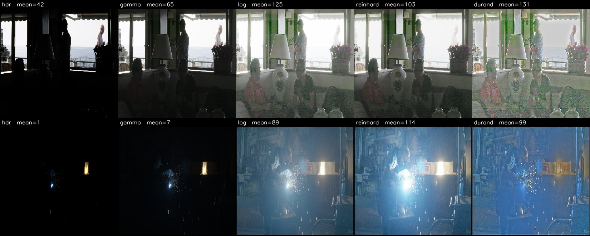

# HDR object detection on HDR4RTT

Work on running object detectors directly on high-dynamic-range imagery, using the
HDR4RTT dataset (4,080 OpenEXR images, 32,964 boxes, 20 Pascal VOC classes).

Two things are in here: a full audit of the dataset, and a rebuilt pipeline for
running [RAOD](https://openaccess.thecvf.com/content/CVPR2023/papers/Xu_Toward_RAW_Object_Detection_A_New_Benchmark_and_a_New_CVPR_2023_paper.pdf)
(CVPR 2023) on it, plus a comparison against conventional tone-map-then-detect.

**[→ Step-by-step progress note](hdr4rtt_rod/progress_note.html)** ·
**[→ Dataset audit](hdr4rtt_analysis/REPORT.md)** ·
**[→ Pipeline details](hdr4rtt_rod/README.md)**

---

> ### ⚠️ Status: work in progress, not peer reviewed
>
> This is an **ongoing internship project**. Results here are preliminary,
> have not been reviewed or published, and **may change or be withdrawn**.
> Several are explicitly flagged below as unreliable — in particular the
> headline figure, for reasons given in [Caveats](#caveats-worth-reading-before-quoting-any-number).
>
> Please do not cite these numbers as established findings. If you want to use
> or build on anything here, get in touch first so you know what has since
> changed.
>
> Provided without warranty of any kind (see [LICENSE](LICENSE)).

---

## Headline results

> **A note on scale.** Every detection number on this page is **mAP x100**
> (percentage points), the convention used in the papers. `pycocotools`, which
> both this work and RAOD run, prints the same values in 0-1 -- so `34.9` here
> appears as `0.349` in the saved JSON under `results/`. They are identical
> numbers.
>
> Being on one scale does **not** make the tables comparable with each other.
> The headline table covers **2 classes**; the tone-mapping table and the thesis
> tables cover **20**. A 2-class average is far higher for the same detector,
> because it excludes the rare classes that drag an average down.


All on the same 779-image leakage-free test set, 4,082 ground-truth boxes,
person and car only.

| arm | input | params | HDR4RTT training | mAP | AP50 | Pedestrian | Car |
|---|---|---|---|---|---|---|---|
| RAOD, zero-shot | HDR | 1M | none | 5.9 | 12.8 | 1.8 | 23.7 |
| RAOD, fine-tuned | HDR | 1M | 4.6 h | 34.9 | 61.3 | 60.2 | 62.4 |
| RetinaNet, zero-shot | tone-mapped | 38M | none | 29.6 | 57.4 | 50.2 | 64.6 |
| Faster R-CNN, zero-shot | tone-mapped | 44M | none | 31.0 | 60.6 | 56.1 | 65.0 |
| **Faster R-CNN, fine-tuned** | tone-mapped | 44M | **0.5 h** | **51.7** | **79.4** | 77.4 | 81.4 |

Fine-tuning lifts RAOD 5.9× overall, and 33× on the class it was effectively
blind to. But the comparison arm is the interesting part: a conventional
tone-map-then-detect pipeline reaches **48% higher mAP in a tenth of the
training time**, and an untrained off-the-shelf detector already matches
fine-tuned RAOD's AP50.

**This does not show that RAOD's approach is wrong.** The comparison is not
capacity-matched — 44M parameters against 1M — and the large detector is
COCO-pretrained on millions of everyday photographs containing exactly "person"
and "car", while RAOD was pretrained on ROD: five traffic classes from a
car-mounted sensor. Both advantages favour the LDR arm for reasons that have
nothing to do with HDR.

What it does show is that the open question is sharper than "how do we improve
RAOD on HDR4RTT". The missing experiment is RAOD's tone-mapping module in front
of the *large* detector: that row minus the row above isolates what the module
contributes when the detector is not tiny.

---

## Two bugs that invalidated earlier work

**1. Wrong input scale in evaluation.** RAOD's data loader divides pixel values
by 255 inside `load_image`, so the network expects `[0,1]`. The evaluation
script skipped it and fed `[0,255]`. Because RAOD's tone-mapping module applies
`x^(1/gamma)` with gamma of 7–10.5, every pixel saturated and the frame
collapsed to white.

The trap: the same division appears **commented out** in `ValTransformRaw` —
the obvious place to look — because it has already happened one level up.

Proof: RAOD's *own* sample image gave **0 detections**; after restoring one
line, **5**, including a car at 0.892 confidence.

**2. The converter optimised for the opposite of what the model wants.** RAOD
tone-maps internally and expects dark, linear input at mean ≈ 0.012. The
previous converter stretched images to fill `[0,255]`, mean 0.377 — **32×
brighter** than anything the model saw in training. Every rescaling variant
tried (p99, adaptive percentile, log, histogram matching) shares that same
"use the full range" goal, so all of them fail the same way.

---

## What the dataset audit found

Every one of the 4,080 EXR files was decoded and measured. Full detail in
[REPORT.md](hdr4rtt_analysis/REPORT.md).

- **It is three sources glued together**, separable for free from the EXR
  headers: 1,289 video/rendered frames, 1,489 bracketed photographs, and 1,302
  frames of one continuous HDR video.
- **Neither value ceiling is over-exposure.** About one pixel per image touches
  it — each image was individually normalised, so the stored values carry no
  absolute brightness meaning.
- **41% of images contain negative pixel values**, down to −872. Any log or
  gamma step must clamp first.
- **303 images (7.4%) form a separate very dark cluster**, ~250× darker than the
  rest, holding 13.1% of all boxes.
- **Median dynamic range is 4.11 decades** (≈13.7 stops), maximum 7.83 (26 stops).
- **The shipped train/test split leaks**: 100% of the video source's test frames
  have a training frame within ±3. Measured cost, with a controlled two-model
  experiment: **+2.0 mAP**, about 6% relative.

Per-image dynamic-range statistics for all 4,080 files are in
[`hdr4rtt_analysis/hdr_stats_sources.csv`](hdr4rtt_analysis/hdr_stats_sources.csv),
which makes it possible to stratify detection results by scene difficulty.

---

## Caveats worth reading before quoting any number

**Scores vary 5× between sources.** Same model, scored per source:

| source | what it is | mAP | AP50 |
|---|---|---|---|
| S1 | video / rendered | 75.5 | **98.2** |
| S3 | HDR video | 32.0 | 60.5 |
| S2 | bracketed photographs | **14.2** | 39.5 |

S1's 98.2 is not a plausible generalisation result. S1 carries no metadata, so
frame sequences cannot be detected and no guard band could be built — it is very
likely contaminated by near-duplicate frames. Visual inspection supports this:
an arbitrary run of 200 consecutive S1 files turned out to be one continuous
living-room scene.

S2 is the only source where the number is unambiguously trustworthy, and it is
much lower than the headline.

**The training set is small.** 2,994 images, but the video source contributes
949 frames from only ~6 contiguous runs — roughly 2,051 genuinely distinct
scenes, about 1.7% the size of a standard detection training set. The good
result is better explained by an easier task (two classes, large objects) and a
strong pretrained starting point than by dataset size.

**Not comparable to TMO-Det.** TMO-Det uses the same underlying dataset but
evaluates all 20 classes on a de-duplicated 1,871-image subset with RetinaNet.
This work uses 2 classes. Placing the numbers side by side would be invalid.

---

## Reproducing

Requires an environment with PyTorch and OpenCV; RAOD's own repository supplies
the model code. Data paths are set at the top of each script.

```bash
# 1. audit the dataset (all 4,080 files)
python hdr4rtt_analysis/scripts/scan_hdr.py
python hdr4rtt_analysis/scripts/sources.py

# 2. build annotations and both splits
python hdr4rtt_rod/build_rod_annotations.py

# 3. convert EXR -> RAOD format (no tone mapping)
python hdr4rtt_rod/convert_hdr4rtt_to_rod.py --gain 0.02

# 4. verify the training path before a long run
python hdr4rtt_rod/smoke_test_train.py --workers 0

# 5. evaluate
python hdr4rtt_rod/eval_rod.py --ann <split>.json --img_dir <images> --gains 1.0
```

For the tone-mapped comparison arm:

```bash
python hdr4rtt_rod/pick_tmo.py                      # choose the operator by measurement
python hdr4rtt_rod/convert_hdr4rtt_to_ldr.py --tmo gamma --percentile 99
python hdr4rtt_rod/train_torchvision.py --arch fasterrcnn
```

**Use batch size 4, not 8, on a 16 GB GPU.** Batch 8 needs 17.51 GB on a 17.1 GB
card, and Windows does not raise an out-of-memory error — it pages GPU memory to
system RAM, so the run silently becomes ~8× slower with no error message. A
batch-8 run reported an 8-day ETA. Details in
[hdr4rtt_rod/README.md](hdr4rtt_rod/README.md).

---

## Layout

| path | contents |
|---|---|
| `hdr4rtt_analysis/` | dataset audit: scripts, report, per-image statistics |
| `hdr4rtt_rod/` | conversion, annotations, splits, training configs, evaluation |
| `hdr4rtt_rod/results/` | every reported number, as saved JSON |
| `hdr4rtt_rod/viz/` | ground truth and predictions drawn on converted images |
| `hdr4rtt_rod/progress_note.html` | step-by-step record of the work |

Checkpoints, converted imagery and the dataset itself are deliberately excluded —
see [.gitignore](.gitignore).

---

## Status of the two review questions

**1. Include the MS thesis results on this page.** Done. Thesis Tables 4.2
(RetinaNet), 4.3 (Faster R-CNN) and 3.1 (CityScapes) are transcribed
[below](#reference-previously-reported-results-on-this-dataset), with attribution
and an explicit statement of why they are not directly comparable.

Reading them surfaced something relevant to question 2: **the thesis already
contains a detector-swap experiment, and its two detectors disagree.** Its
learned method beats every classical operator under RetinaNet (31.6 vs 31.3) and
loses to four of them under Faster R-CNN (27.7 vs 29.5). Same method, same data,
opposite conclusion.

**2. Compare the 2023 paper and the thesis method fairly, given they used
different detectors.** Partly answered.

| | status |
|---|---|
| Detector held fixed, front end varied | **done** -- [nine arms, one detector](#which-tone-map-one-detector-nine-front-ends) |
| RAOD's module measured under that control | **done** -- 36.1 mAP |
| Thesis TMO-GAN measured under that control | **not possible** -- software lost |
| Indirect comparison via a shared reference | **done** -- see below |

The two learned methods have still never been run side by side. What this
repository adds is a controlled measurement of one of them, plus an indirect
comparison of both against the best classical operator in their respective
experiments (+0.3 for the thesis method, -2.2 for RAOD's). Closing the gap
properly requires re-implementing TMO-GAN from the paper.

## Which tone map? One detector, nine front ends

The comparison above changes two things at once (detector and input), so it
cannot separate them. This experiment holds the detector fixed --
RetinaNet R50-FPN v2, all 20 classes, 845 test images -- and changes **only**
what happens to the pixels beforehand. Same data, split, schedule, batch size
and augmentation throughout.



*The same two photographs through the five **fixed** front ends (rows 1, 2, 3,
5 and 9 of the table). Left column is row 9, the raw conversion with no curve:
in the workshop scene the welding arc consumes the entire output range and
everything else goes black. The four to its right are identical data under
different curves. The CVPR 2023 learned method is not shown, because it produces
a different curve for every photograph rather than a fixed image set.*

**Whose method is each row?**

| # | front end | whose method | mAP | AP50 | AP small | Kocdemir's mAP for the same operator |
|---|---|---|---|---|---|---|
| 1 | **Reinhard** | classical, 2002 | **38.3** | **56.7** | 7.0 | 29.6 |
| 2 | HDR with gamma | standard display curve | 36.5 | 54.8 | 5.7 | 29.8 |
| 3 | Durand | classical, 2002 | 36.4 | 53.1 | 5.4 | 30.6 |
| 4 | **RAOD module** — full learning rate | **learned, CVPR 2023** | **36.1** | 52.1 | 5.2 | not in his tables |
| 5 | Log compression | simple formula | 35.9 | 54.4 | 8.2 | not in his tables |
| 6 | **RAOD module** — random start | **learned, CVPR 2023** | 35.7 | 52.9 | 6.3 | not in his tables |
| 7 | **RAOD module** — as published | **learned, CVPR 2023** | 35.4 | 52.3 | 6.8 | not in his tables |
| 8 | **RAOD module** — input rescaled | **learned, CVPR 2023** | 34.4 | 50.9 | 6.3 | not in his tables |
| 9 | **HDR, no tone curve** | no method at all | **30.4** | 47.6 | **1.1** | 26.3 |

Reading the table:

* **Rows 4, 6, 7, 8 are the CVPR 2023 method** (RAOD's learned Adaptive_Module),
  run four times with one setting changed each time. They are the same method,
  not four different ones.
* **Rows 1, 2, 3, 5 are fixed formulas** that anyone can apply — no learning
  involved. Rows 1 and 3 are the classical operators that also appear in the
  thesis.
* **Row 9 is the control**: the raw values with nothing applied.
* **Kocdemir's TMO-GAN is NOT in this table.** Its software was lost and could
  not be run. His published number (31.6) is on a different scale and cannot be
  placed here — see [the section below](#comparing-the-two-learned-methods-across-experiments).
* The last column is **his** published figure for that same operator, measured
  in **his** experiment. It is there to show the two experiments rank the
  operators differently, not to be compared row-against-row with ours.

### What it shows

**Applying no tone curve is by far the worst option**, and catastrophic for small
objects (1.1 against 5-8). This independently replicates the thesis result --
raw HDR was worst there too, under both of its detectors -- and matches what the
RAOD arm showed, where the same weights on the same data scored 5.9 with the
input scale wrong and 34.9 with it right. Three separate experiments agree.

**Which curve you choose barely matters.** The four sensible operators span 35.9
to 38.3, a 2.4-point range, while the gap between "no curve" and "any curve" is
about 6 points. Doing something reasonable captures most of the benefit.

**RAOD's learned module did not beat a formula from 2002.** Reinhard, a
one-line operator, leads it by 2.2 mAP. Suspecting the configuration rather than
the method, three variants were retrained, isolating one setting each: full
learning rate (36.1), random initialisation instead of RAOD's released weights
(35.7), and input rescaled to the level those weights were fitted at (34.4).
All four land below every sensible fixed operator, so the result is not an
artefact of the settings chosen.

Notably, the rescaling variant made things **worse**, not better -- the assumed
input-scale mismatch was not the limiting factor, and correcting it cost 1.0 mAP.

**This does not show RAOD's method is wrong.** RAOD pairs the module with a
1M-parameter detector, where a strong front end plausibly matters far more; a
38M-parameter detector may already absorb internally whatever the module was
supplying. The thesis tables show the same pattern from the other side -- its
learned method beats every classical operator under RetinaNet and loses to four
of them under Faster R-CNN. **The value of a learned tone map appears to depend
on the detector behind it**, which is the thread worth pulling next.

### What this experiment cannot answer

Every arm here starts from HDR, so none of them tests HDR against a genuine
ordinary-camera exposure of the same scene. The thesis can: its real LDR row
scores 28.2, below tone-mapped HDR at 29.6-31.3 but above raw HDR at 26.3. On
that evidence HDR is worth roughly 2-3 mAP, **but only once tone mapped** --
untouched, it is worse than an ordinary photograph.

## Reference: previously reported results on this dataset

From İ. H. Kocdemir's MS thesis (and the corresponding Pattern Recognition
Letters 172 (2023) 230–236 paper), on the dataset the thesis calls **OOD** —
20 Pascal VOC classes, near-identical video frames removed, 1,491 train /
380 test, images at 1024×576.

**Detector: RetinaNet** (thesis Table 4.2)

| front end | joint | on real | mAP | TMQI-Q |
|---|---|---|---|---|
| HDR (raw, no normalisation) | | | **26.3** | – |
| LDR | | | 28.2 | 76.1 |
| Reinhard | | | 29.6 | 89.6 |
| HDR with gamma | | | 29.8 | – |
| Fattal | | | 29.8 | 88.8 |
| Best TMO per picture | | | 30.0 | 94.9 |
| TMO-GAN | ✗ | | 30.0 | 94.6 |
| Ashikhmin | | | 30.1 | 88.4 |
| TMO-GAN + RetinaNet (COCO) | ✓ | ✓ | 30.2 | 94.2 |
| Durand | | | 30.6 | 89.0 |
| Std. LDR | | | 31.0 | 88.9 |
| Mantiuk | | | 31.3 | 86.5 |
| **TMO-GAN + RetinaNet (OOD)** | ✓ | ✓ | **31.6** | 94.5 |

**Detector: Faster R-CNN** (thesis Table 4.3)

| front end | joint | on real | mAP | TMQI-Q |
|---|---|---|---|---|
| HDR (raw, no normalisation) | | | **23.5** | – |
| LDR | | | 24.7 | 76.1 |
| TMO-GAN + Faster R-CNN (COCO) | ✓ | ✗ | 26.3 | 94.2 |
| TMO-GAN + Faster R-CNN (COCO) | ✓ | ✓ | 27.3 | 94.0 |
| HDR with gamma | | | 27.7 | – |
| **TMO-GAN + Faster R-CNN (OOD)** | ✓ | ✓ | 27.7 | 94.3 |
| Reinhard | | | 28.1 | 89.6 |
| Std. LDR | | | 28.3 | 88.9 |
| TMO-GAN | ✗ | | 28.6 | 94.6 |
| Durand | | | 28.8 | 89.0 |
| Ashikhmin | | | 28.9 | 88.4 |
| Mantiuk | | | 29.1 | 86.5 |
| **Fattal** | | | **29.5** | 88.8 |

For context, thesis Table 3.1 reports the same comparison on **CityScapes**,
where HDR with gamma (33.3 mAP) barely separates from Std. LDR (33.1) — the
thesis states plainly that no advantage for HDR was observed there.

### Two things these tables show

**Raw HDR is the worst input in both.** 26.3 and 23.5, below even plain LDR.
Normalisation, not bit depth, is what the detector needs — which is exactly what
this work found independently: RAOD scored 5.9 when the input scale was wrong
and 34.9 when it was right, on identical data and weights.

**The detector changes the conclusion.** With RetinaNet the learned joint method
wins (31.6, above Mantiuk's 31.3). With Faster R-CNN it does not — 27.7, below
four classical operators, with Fattal best at 29.5. The same method, the same
data, opposite verdicts depending on the detector behind it.

### Comparing the two learned methods across experiments

The thesis method (TMO-GAN) could not be re-run: its software was lost. So the
two learned front ends -- the thesis one and RAOD's -- have never been measured
side by side, and the obvious fix does not work.

**The failed approach: shared operators as calibration anchors.** Four operators
appear in both experiments, so in principle they could map one scale onto the
other. They do not. The rankings invert:

| operator | thesis rank (RetinaNet) | rank here |
|---|---|---|
| Reinhard | **worst** tone map, 29.6 | **best**, 38.3 |
| Durand | best of the three, 30.6 | middle, 36.4 |
| HDR with gamma | 29.8 | 36.5 |

That is an inversion rather than an offset, so no scale factor reconciles the
two tables and the thesis's 31.6 cannot be placed on this axis. It is recorded
here as a negative result: **do not** compare the absolute numbers.

**What does work: each method against the best classical operator in its own
experiment.** That reference is meaningful in both, and the ratio cancels the
differences in split, resolution and detector version:

| learned method | own score | best classical, same table | **gap** |
|---|---|---|---|
| TMO-GAN + RetinaNet (thesis) | 31.6 | 31.3 (Mantiuk) | **+0.3** |
| RAOD Adaptive_Module (here) | 36.1 | 38.3 (Reinhard) | **-2.2** |

Read this way, the thesis method **slightly beat** the strongest classical
operator available to it, while RAOD's module **fell behind** the strongest
one available here, by 2.2 mAP. The difference between the two learned
approaches is therefore about 2.5 mAP in the thesis method's favour, measured
relative to a shared reference rather than on a shared scale.

**Caveats on that number.** The best classical operator differs between the two
(Mantiuk there, Reinhard here) and Mantiuk is not implemented in this
repository; were it stronger than Reinhard on this data, the gap here would
widen rather than narrow. Both experiments also use different splits and
different RetinaNet implementations. This is a defensible indirect comparison,
not a head-to-head.

**What would close it properly:** re-implement TMO-GAN from the paper -- a
generator and discriminator trained jointly with the detector -- and run it as a
seventh front end here. Then both learned methods sit in one table under one
detector, and the comparison is direct rather than inferred.

### These numbers are NOT comparable with the table at the top

| | thesis | this work |
|---|---|---|
| classes | 20 | 2 (person, car) |
| test images | 380 | 779 |
| duplicate frames | removed entirely | separated by split |
| resolution | 1024×576 | 1280×1280 |
| detectors | RetinaNet, Faster R-CNN | RAOD YOLOX, Faster R-CNN v2 |

Averaging over 20 classes — several with only a handful of instances — pulls any
score far below a 2-class average. Placing 51.7 next to 31.6 would be
meaningless. They are recorded here as reference, not as a head-to-head.

## A note on choosing the tone-mapping operator

The LDR arm could easily have been rigged. Scoring eight operators with a
COCO-pretrained detector showed a **10% relative spread** in the resulting mAP,
so a careless choice would have decided the comparison before any training
happened. Gamma at the 99th percentile won and was used throughout. TMO-Det
handles this the same way, comparing six operators and reporting the best.

`pick_tmo.py` reproduces the sweep.

## Licence, attribution and disclaimer

Code in this repository is © 2026 Sana Niroomand and the **OGAM Research
Laboratory, Middle East Technical University (METU)**, released under the
[MIT licence](LICENSE). It is research code: provided as is, without warranty,
and not intended for production or safety-related use.

Full third-party attribution is in [NOTICE](NOTICE). In summary:

| what | relationship | terms |
|---|---|---|
| **RAOD** (Xu et al., CVPR 2023) | two config files are **modified derivatives**; other files call it at runtime | © Huawei + Megvii, **Apache 2.0** — see [LICENSE-Apache-2.0.txt](LICENSE-Apache-2.0.txt) |
| RAOD model weights | not redistributed | original terms |
| **TMO-Det** (Kocdemir et al.) | **no code used** — results quoted only | © authors and publisher |
| Reinhard, Durand operators | algorithms re-implemented from the papers | methods credited to their authors |
| torchvision, OpenCV, pycocotools | called as libraries | BSD / Apache 2.0 |
| HDR4RTT / OOD dataset | **not redistributed**, in any form | obtain from its creators |

The two derivative files — `cfg_hdr4rtt_rod.py` and `cfg_hdr4rtt_rod_original.py` —
remain under Apache 2.0 and carry headers stating exactly what was changed, as
that licence requires. Everything else in this repository is original work under
MIT.

**The tone-mapping operators here are simplified re-implementations**, tuned
against this dataset. They should not be taken as reference implementations of
the published methods, and any weakness in them is mine rather than the original
authors'.

**Please cite the original work, not this repository, for the methods it builds on:**

> R. Xu, C. Chen, J. Peng, C. Li, Y. Huang, F. Song, Y. Yan, Z. Xiong.
> *Toward RAW Object Detection: A New Benchmark and a New Model.* CVPR 2023.

> İ. H. Kocdemir, A. Koz, A. O. Akyuz, et al.
> *TMO-Det: Deep tone-mapping optimized with and for object detection.*
> Pattern Recognition Letters 172 (2023) 230–236.

Tables from the thesis and paper are reproduced here for academic comparison
with attribution. They are **quoted, not reproduced experimentally** — the
original software was lost, so those numbers could not be re-run, and this is
stated wherever they appear.

Any errors in this repository are mine and not those of the original authors.

## Open questions

1. **Check S1 for duplicate frames** using image similarity, since it has no
   metadata. The 98.2 score makes this the highest priority — it affects
   whether the headline numbers mean anything.
2. **Put RAOD's tone-mapping module in front of the large detector.** This is
   the missing row, and the only one that isolates the module's contribution
   from the detector's capacity and pretraining.
3. **Match capacity honestly** — either shrink the LDR arm or grow the HDR arm —
   so the HDR-versus-tone-mapped question is not confounded by model size.
4. **Run RAOD under TMO-Det's protocol** — their filtering, their splits, all 20
   classes — for a genuinely comparable number.
